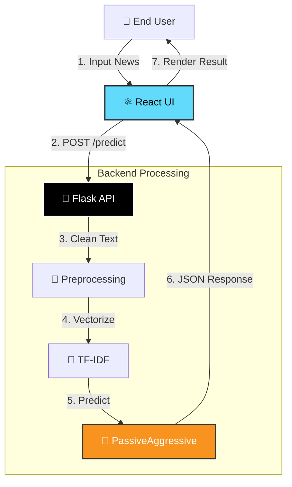

<div align="center">

# 📰 Truth Teller
### The AI-Powered Disinformation Defense System


<br />


<br />
<br />

[**🚀 Launch Live Demo**](https://news-truth-checker.lovable.app/)
·
[**⚙️ Backend API Docs**](https://truth-teller-backend-production.up.railway.app)
·
[**🐛 Report a Bug**](https://github.com/astromanu007/truth-teller/issues)

</div>

---

## 🔍 Problem Statement
In the digital age, misinformation spreads 6x faster than factual news. Manual fact-checking cannot keep pace with the volume of content generated daily. **Truth Teller** solves this by automating the verification process using advanced Natural Language Processing (NLP).

## ✨ Key Features
**Truth Teller** is not just a model; it is a full-stack engineering solution.

### 🧠 **Intelligent Analysis**
* **Hybrid NLP Engine:** Uses TF-IDF Vectorization combined with a Passive Aggressive Classifier for high-dimensional text analysis.
* **Real-Time Inference:** Delivers prediction results in **< 200ms**.
* **Confidence Quantification:** Returns a precise probability score (e.g., *98.5% confidence*), not just a binary output.

### 🖥️ **Production-Grade UI/UX**
* **Responsive Architecture:** Fully optimized for Desktop, Tablet, and Mobile via Tailwind CSS.
* **Visual Feedback:** Dynamic color grading (Green for Real, Red for Fake) for immediate cognitive recognition.
* **Clean Input Stream:** Large-context text area capable of processing full-length articles or short headlines.

### ⚙️ **Robust Backend Engineering**
* **RESTful API Standard:** Stateless architecture ensuring easy scaling.
* **CORS Enabled:** Secure cross-origin resource sharing for third-party integrations.
* **Health Monitoring:** Dedicated `/health` endpoint for uptime checks.

---

## 🛠️ Technology Stack
Built with industry-standard tools for reliability and scale.

| Category | Technologies |
| :--- | :--- |
| **Frontend** |     |
| **Backend** |    |
| **Machine Learning** |     |
| **DevOps & Cloud** |    |

---

## 📐 System Architecture

The application follows a **Decoupled Microservices Pattern**. The React frontend communicates with the Python ML backend via JSON over HTTPS.



---

## 📊 Performance Analytics

The model was trained and tested on a dataset of **~20,000 news articles** (ISOT Fake News Dataset).

### 🏆 Test Set Results (8,978 Samples)

| Metric | Score | Definition |
| --- | --- | --- |
| **Accuracy** | **99.89%** | Overall correctness of the model. |
| **Precision** | **1.00** | Accuracy of positive predictions. |
| **Recall** | **1.00** | Ability to find all positive instances. |
| **F1-Score** | **1.00** | Harmonic mean of Precision and Recall. |

### 📉 Confusion Matrix

*A visual representation of the model's reliability.*

|  | **Predicted REAL** | **Predicted FAKE** |
| --- | --- | --- |
| **Actual REAL** | **4,687** ✅ | 8 ❌ |
| **Actual FAKE** | 2 ❌ | **4,281** ✅ |

> **Analysis:** The model only misclassified 10 articles out of nearly 9,000, demonstrating exceptional capability in distinguishing linguistic patterns between legitimate journalism and fabricated stories.

---

## 🔌 API Reference

Integrate Truth Teller into your own applications.

#### Base URL: `https://truth-teller-backend-production.up.railway.app`

### `POST /predict`

Classifies a text string.

**Request Body:**

```json
{
  "text": "Breaking: Aliens have landed in Times Square and are demanding pizza."
}

```

**Response:**

```json
{
  "success": true,
  "prediction": "FAKE",
  "confidence": 99.2,
  "processed_timestamp": "2023-10-27T10:00:00Z"
}

```

---

## 🏎️ Local Installation

Want to run this locally? Follow these steps.

1. **Clone the Repo**
```bash
git clone [https://github.com/astromanu007/truth-teller.git](https://github.com/astromanu007/truth-teller.git)
cd truth-teller

```


2. **Start Backend**
```bash
cd truth-teller\public\fake-news-backend
pip install -r requirements.txt
python app.py

```

---

## 👤 Author

**Mr. Manish Dhatrak** *National Innovator | AI & ML Researcher*

I am passionate about leveraging Artificial Intelligence to solve complex societal problems.

---

<div align="center">
<sub>Built with precision. Deployed with passion. © 2025 Truth Teller.</sub>
</div>

```

```
